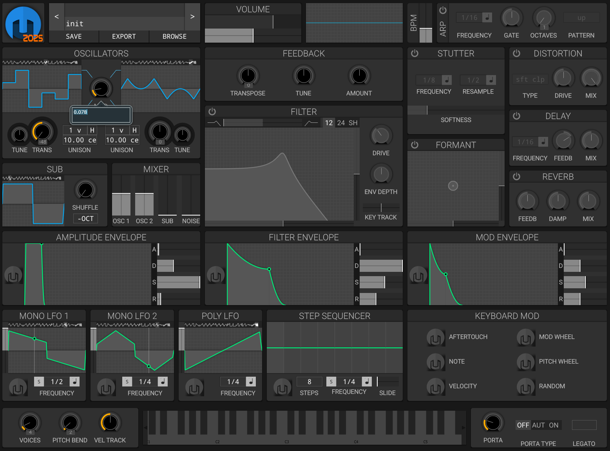

# Helm2025

Helm2025 is a modern, cross-platform, polyphonic synthesizer for GNU/Linux, macOS, and Windows. It is available as a standalone application and as LV2, VST3, and AU plugins.



---

## About This Project

Helm2025 is a significantly modernized and independent fork of Matt Tytel's original [Helm synthesizer](https://github.com/mtytel/helm), started from the [bepzi/helm fork](https://github.com/bepzi/helm). It features major performance, stability, and usability improvements, as well as new synthesis and UI features.

---

## Key Features

- Up to **32-voice polyphony**
- **Step sequencer up to 64 steps** (editing, modulation, audio engine, and patch save/load)
- Interactive, real-time visual interface
- Powerful modulation system with live feedback
- Dual oscillators with cross-modulation and up to 15 unison voices each
- Sub oscillator with shuffle waveshaping
- Oscillator feedback and saturation
- 21 waveforms, including advanced and hybrid shapes
- Blendable 12/24dB low/band/high pass and shelf filters
- 2 monophonic and 1 polyphonic LFO
- Many modulation sources, including polyphonic aftertouch
- Simple arpeggiator
- Effects: formant filter, stutter, delay, distortion, reverb

---

## Recent Improvements (October 2025)

### Step Sequencer
- **Up to 64 steps**: The step sequencer now supports up to 64 steps throughout the UI, modulation system, audio engine, and patch management.
- **Stability**: Fixed all crashes and limitations when editing or automating steps above 32. All code paths (parameters, UI, DSP) now handle 64 steps reliably.

### LFO Synchronization & Randoms
- **Perfect LFO/Visualization Sync**: LFO modulation and the OpenGL waveform viewer are now always perfectly synchronized, for all LFO types (including S&H, S&G, WhiteNoise) in both mono and poly modes.
- **Deterministic Randoms**: S&H, S&G, and WhiteNoise LFOs use a deterministic, cycle-synchronized random sequence. The random values are generated with a reproducible seed, so modulation and visual curve always match, even with dynamic LFO rate changes.
- **Musical Step Count**: S&H and S&G LFOs use a fixed, musically useful number of random steps per cycle (16), regardless of LFO rate.
- **Cycle-Accurate Renewal**: The random sequence is renewed every LFO cycle, even in free-running mode, ensuring a new random pattern for each cycle in both sound and UI.
- **Robust Polyphonic Support**: All improvements apply to both monophonic and polyphonic LFOs, with robust handling of all edge cases (UI switching, frequency changes, etc).
- **Crash-Proof Visualization**: The OpenGL viewer is robust against all edge cases (buffer underrun, null pointers, etc) and never crashes when switching LFO type or frequency.

### UI & Workflow
- **Intuitive waveform selection**: On all waveform selectors (LFO, oscillators, sub, etc.), clicking the left half selects the previous waveform, clicking the right half selects the next. This works in the OpenGL viewer, WaveSelector, and WaveViewer. The TextSlider retains direct selection by click position.

---

## Building Helm2025

### Prerequisites
- **Git** (for cloning the repository and submodules)
- **CMake** (version 3.15 or higher)
- **C++17 compiler** (e.g., Visual Studio 2019/2022, GCC 7+, Clang 6+)
- **PowerShell** (for Windows users running the build script)
- **(Optional) ASIO SDK** (for professional low-latency audio on Windows; see [Steinberg website](https://www.steinberg.net/developers/))

### Quick Start (Recommended)

#### Windows
1. Open PowerShell in the project directory.
2. Run:
   ```powershell
   .\build.ps1
   ```
   This script will initialize dependencies, run CMake, build all targets, and create an installer.

#### macOS & Linux (or manual Windows)
1. Initialize dependencies:
   ```bash
   git submodule update --init --recursive
   ```
2. Configure with CMake:
   ```bash
   cmake -S . -B build
   ```
3. Build:
   ```bash
   cmake --build build
   ```

### Build System Highlights
- **Automated dependency management**: JUCE and Steinberg VST3 SDK are included as Git submodules and downloaded automatically.
- **Robust build script**: The Windows build script automates the entire process, with clear, color-coded output.
- **ASIO support**: The GPLv3 Steinberg ASIO SDK is included for Windows builds.

---

## License & Credits

Helm2025 is free software, released under the GNU GPLv3. It is based on the original Helm synthesizer by Matt Tytel, with major modifications and new features by Hans45 and contributors. See the source code and [COPYING](COPYING) for details.

---

For more information, screenshots, and updates, visit the project repository.
